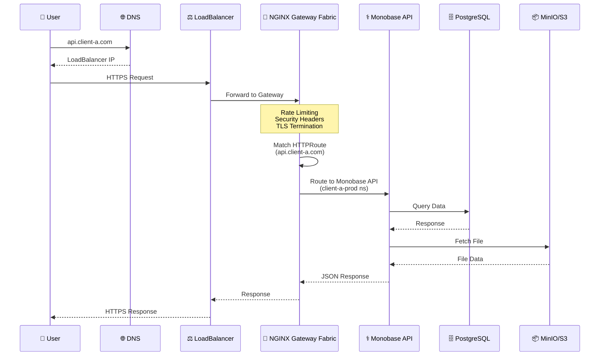
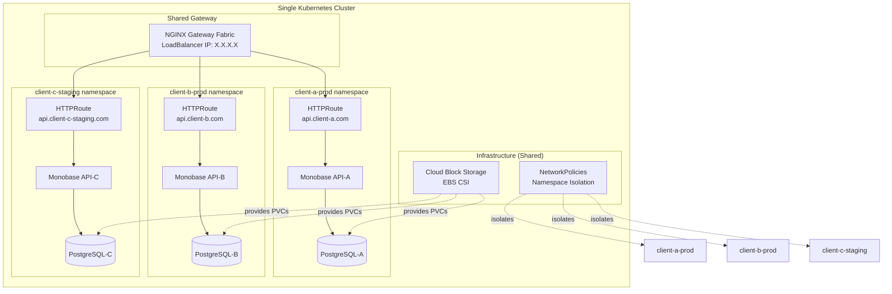

# Architecture Documentation

Technical architecture of the Monobase Infrastructure template.

## Table of Contents

1. [Overview](#overview)
2. [System Architecture](#system-architecture)
3. [Gateway Architecture](#gateway-architecture)
4. [Storage Architecture](#storage-architecture)
5. [Security Architecture](#security-architecture)
6. [Backup Architecture](#backup-architecture)
7. [Monitoring Architecture](#monitoring-architecture)

---

## Overview

### Design Principles

1. **No Overengineering** - Simple, proven technologies for <500 users
2. **Security by Default** - Zero-trust, encryption everywhere
3. **Fork-Based Workflow** - Reusable template, client-specific configuration
4. **Cloud-Native** - Kubernetes-native, CNCF projects preferred
5. **Cost-Effective** - Shared infrastructure, optional components

### High-Level System Architecture

```mermaid
graph TB
    subgraph "Internet"
        Users[👥 Users/Clients]
    end
    
    subgraph "Kubernetes Cluster"
        subgraph "nginx-gateway-system namespace"
            Gateway[🌐 NGINX Gateway Fabric<br/>nginx-shared-gateway<br/>2 data-plane replicas]
        end
        
        subgraph "client-a-prod namespace"
            Monobase API1[⚕️ Monobase API<br/>3 replicas]
            Monobase Account1[📱 Monobase Account<br/>2 replicas]
            API Worker1[🔄 API Worker<br/>2 replicas]
            PostgreSQL1[(🗄️ PostgreSQL<br/>primary + read replica)]
            MinIO1[(📦 MinIO<br/>6-node distributed)]
        end
        
        subgraph "client-b-prod namespace"
            Monobase API2[⚕️ Monobase API]
            Apps2[📱 Apps...]
        end
        
        subgraph "Infrastructure"
            CSI[💾 Cloud Block Storage<br/>EBS CSI]
            ArgoCD[🔄 ArgoCD GitOps]
            ExtSecrets[🔐 External Secrets]
            CertMgr[🔒 cert-manager]
            Velero[💼 Velero Backups]
        end
    end
    
    subgraph "Cloud Provider KMS"
        KMS[🔑 AWS Secrets Manager<br/>Azure Key Vault<br/>GCP Secret Manager]
    end
    
    Users -->|HTTPS| Gateway
    Gateway -->|HTTPRoute| Monobase API1
    Gateway -->|HTTPRoute| Monobase Account1
    Gateway -->|HTTPRoute| Monobase API2
    Monobase API1 --> PostgreSQL1
    Monobase API1 --> MinIO1
    API Worker1 --> PostgreSQL1
    ArgoCD -.->|manages| Monobase API1
    ArgoCD -.->|manages| Monobase Account1
    ExtSecrets -->|fetches| KMS
    ExtSecrets -.->|injects| Monobase API1
    Velero -.->|backups| PostgreSQL1
    CSI -.->|provides storage| PostgreSQL1
```

### Technology Stack

**Core (Always Deployed):**

- Kubernetes 1.27+ (EKS, AKS, GKE, DOKS, or self-hosted)
- NGINX Gateway Fabric (Gateway API)
- Cloud block storage CSI (`ebs.csi.aws.com` on the example EKS cluster; Longhorn is an optional profile for the on-prem-k3s provider only)
- ArgoCD (GitOps)
- External Secrets Operator (KMS integration)
- cert-manager (TLS automation)

**Applications:**

- Monobase API (API backend)
- Monobase Account (Vue.js frontend)
- PostgreSQL (primary database; primary + streaming read replica)

**Optional:**

- API Worker (real-time sync)
- MinIO (self-hosted S3)
- Valkey (Redis-compatible cache)
- Velero (Kubernetes backups)
- Prometheus + Grafana (monitoring)

**NOT Included (Deliberately):**

- ❌ Service Mesh (Istio/Linkerd) - Overkill for 3 services
- ❌ Self-hosted Vault - Use cloud KMS instead
- ❌ Rook-Ceph - Cloud block storage + MinIO simpler

---

## System Architecture

### Request Flow Diagram



### Multi-Tenant Architecture



### Component Diagram

```
                    Internet / DNS
                          |
                   [LoadBalancer IP]
                          |
        ┌─────────────────┴─────────────────┐
        │  nginx-gateway-system namespace   │
        │  ┌──────────────────────────────┐ │
        │  │   Shared NGINX Gateway (NGF) │ │
        │  │   - HTTPS listener (443)     │ │
        │  │   - HA: 2 replicas           │ │
        │  │   - Rate limiting            │ │
        │  │   - Security headers         │ │
        │  └──────────────────────────────┘ │
        └────────────────┬──────────────────┘
                         │
        ┌────────────────┴──────────────────┐
        │   myclient-prod namespace         │
        │                                   │
        │  ┌────────────────────────────┐  │
        │  │ HTTPRoutes (per service)   │  │
        │  │ - api.myclient.com         │  │
        │  │ - app.myclient.com         │  │
        │  │ - sync.myclient.com        │  │
        │  └─────┬──────────────────────┘  │
        │        │                          │
        │  ┌─────┴──────┬────────┬────────┐│
        │  │            │        │        ││
        │ ┌▼──────┐ ┌──▼────┐ ┌▼──────┐ ││
        │ │Monobase API│ │ API Worker │ │Account│ ││
        │ │ App   │ │       │ │ App   │ ││
        │ │2-3 rep│ │2 rep  │ │2 rep  │ ││
        │ └───┬───┘ └───┬───┘ └───────┘ ││
        │     │         │                ││
        │  ┌──┴─────────┴──┐             ││
        │  │               │             ││
        │ ┌▼────────────┐ ┌▼─────────┐  ││
        │ │  PostgreSQL    │ │  MinIO   │  ││
        │ │  Primary +  │ │ Distrib. │  ││
        │ │  read repl. │ │ 6 nodes  │  ││
        │ └──────┬──────┘ └────┬─────┘  ││
        │        │             │         ││
        │  ┌─────┴─────────────┴──────┐ ││
        │  │   Cloud Block Storage    │ ││
        │  │   - EBS CSI (gp3)        │ ││
        │  │   - Provider-replicated  │ ││
        │  │   - Velero backups       │ ││
        │  └──────────────────────────┘ ││
        └────────────────────────────────┘
```

### Data Flow

**1. User Request → Monobase API:**

```
Browser → DNS → LoadBalancer → Gateway (443) 
  → HTTPRoute (api.myclient.com) → Monobase API Service (7500) 
  → Monobase API Pod → PostgreSQL (5432)
```

**2. User Request → Frontend:**

```
Browser → DNS → LoadBalancer → Gateway (443)
  → HTTPRoute (app.myclient.com) → Monobase Account Service (80)
  → Monobase Account Pod (nginx serving static files)
```

**3. File Upload Flow:**

```
Client → Monobase API → MinIO S3 API (9000)
  → Block-storage PVC (EBS gp3)
```

**4. File Download Flow:**

```
Client → Monobase API (generates presigned URL)
  → Client downloads directly from MinIO via Gateway
  → HTTPRoute (storage.myclient.com) → MinIO (9000)
```

---

## Gateway Architecture

### Shared Gateway Strategy

**Key Decision: 1 Gateway + Dynamic HTTPRoutes**

```
┌─────────────────────────────────────┐
│ nginx-gateway-system ns (shared)   │
│                                     │
│  ┌───────────────────────────────┐ │
│  │   nginx-shared-gateway (NGF)  │ │
│  │   - HTTPS listeners           │ │
│  │   - Wildcard: *.myclient.com  │ │
│  │   - HA: 2 nginx replicas      │ │
│  │     (infra node pool)         │ │
│  │   - Single LoadBalancer IP    │ │
│  └───────────────────────────────┘ │
└──────────────┬──────────────────────┘
               │ References
    ┌──────────┼──────────┐
    │          │          │
┌───▼────┐ ┌──▼─────┐ ┌─▼──────┐
│Client A│ │Client B│ │Client C│
│HTTPRtes│ │HTTPRtes│ │HTTPRtes│
└────────┘ └────────┘ └────────┘
```

**Benefits:**

- ✅ **Zero-downtime client onboarding** - HTTPRoutes added dynamically
- ✅ **Single LoadBalancer IP** - Cost-effective
- ✅ **Independent routing** - Each client controls their routes
- ✅ **Flexible hostnames** - Any domain per service

**HTTPRoute Pattern:**

```yaml
apiVersion: gateway.networking.k8s.io/v1
kind: HTTPRoute
spec:
  parentRefs:
    - name: nginx-shared-gateway  # References shared Gateway
      namespace: nginx-gateway-system
  hostnames:
    - api.client.com       # Client-specific domain
  rules:
    - backendRefs:
        - name: api
          port: 7500
```

---

## Storage Architecture

### Cloud Block Storage

The example `aws-main` cluster runs on AWS EKS and uses EBS block storage via
the `ebs.csi.aws.com` CSI driver (a `gp3` StorageClass as the cluster default):

```
┌──────────────────┐
│  StatefulSets    │
│  - PostgreSQL    │
│  - MinIO         │
│  - Valkey        │
└────────┬─────────┘
         │ PVC (EBS gp3)
         ▼
┌─────────────────────────────────────────┐
│  AWS EBS Block Storage (CSI)            │
│  - Provider-replicated volumes          │
│  - Encryption at rest (provider)        │
│  - Online volume expansion              │
│  - Off-cluster backups via Velero       │
└─────────────────────────────────────────┘
```

On other providers the same pattern applies with that provider's default CSI
(Azure Disk on AKS, PD on GKE, `do-block-storage` on DOKS). Longhorn is an
optional profile for the `on-prem-k3s` provider only; it is not deployed on the
cloud clusters (see [STORAGE.md](../operations/STORAGE.md)).

### MinIO Distributed Storage (Optional)

```
┌─────────────────────────────────────────┐
│     MinIO Erasure Coding (EC:2)         │
│                                          │
│  6 Nodes × 250Gi = 1.5TB raw            │
│  4 data + 2 parity = ~1TB usable (66%)  │
│                                          │
│  ┌──────┐ ┌──────┐ ┌──────┐            │
│  │Data 1│ │Data 2│ │Data 3│            │
│  │250Gi │ │250Gi │ │250Gi │            │
│  └──────┘ └──────┘ └──────┘            │
│  ┌──────┐ ┌──────┐ ┌──────┐            │
│  │Data 4│ │Parity│ │Parity│            │
│  │250Gi │ │ 1    │ │  2   │            │
│  └──────┘ └──────┘ └──────┘            │
│                                          │
│  Can lose 2 nodes without data loss     │
└──────────────────────────────────────────┘
```

**Why MinIO:**

- S3-compatible API
- No egress fees (self-hosted)
- <1TB data (cost-effective)
- Full control

**Why External S3:**
>
- >1TB data (scale better)
- Global CDN integration
- Managed service
- Built-in redundancy

---

## Security Architecture

### Zero-Trust Network Model

```
Default: DENY ALL
    ↓
┌─────────────────────────────────┐
│  All traffic blocked by default │
└─────────────────────────────────┘
    ↓
Explicit ALLOW rules:
    ↓
┌─────────────────────────────────┐
│ ✅ Gateway → Apps               │
│ ✅ Apps → PostgreSQL               │
│ ✅ Apps → Storage               │
│ ✅ Apps → Internet (HTTPS)      │
│ ❌ Cross-namespace (blocked)    │
│ ❌ Direct pod access (blocked)  │
└─────────────────────────────────┘
```

### Defense in Depth

**Layer 1: Network (NetworkPolicies)**

- Default deny all traffic
- Explicit allow rules only
- Cross-namespace isolation
- DNS and K8s API allowed

**Layer 2: Pod (Pod Security Standards)**

- Non-root containers
- No privilege escalation
- Drop ALL capabilities
- Read-only root filesystem
- seccomp profile enforced

**Layer 3: Application (RBAC)**

- Dedicated service accounts
- Least-privilege roles
- No default SA usage
- Namespace-scoped permissions

**Layer 4: Data (Encryption)**

- At rest: provider block-storage encryption + PostgreSQL
- In transit: TLS everywhere (cert-manager)
- Backups: S3 + KMS encryption

**Layer 5: Access (External Secrets)**

- Secrets never in Git
- KMS integration (AWS/Azure/GCP)
- Automatic rotation
- Audit logging

---

## Backup Architecture

### 3-Tier Backup Strategy

```
┌─────────────────────────────────────────┐
│  Tier 1: Volume Snapshots (Fast)        │
│  - Storage: Provider (CSI snapshots)    │
│  - Retention: 72 hours                  │
│  - Recovery: ~5 minutes                 │
│  - Use: Quick rollback, recent issues   │
└─────────────────────────────────────────┘
              ↓
┌─────────────────────────────────────────┐
│  Tier 2: Daily Backups (Medium)         │
│  - Storage: S3 (off-cluster)            │
│  - Retention: 30 days                   │
│  - Recovery: ~1 hour                    │
│  - Use: Last month recovery             │
└─────────────────────────────────────────┘
              ↓
┌─────────────────────────────────────────┐
│  Tier 3: Weekly Archive (Long-term)     │
│  - Storage: S3 Glacier (cold)           │
│  - Retention: 90+ days (HIPAA)          │
│  - Recovery: ~4 hours                   │
│  - Use: Compliance, disaster recovery   │
└─────────────────────────────────────────┘
```

**Backup Methods:**

1. **CSI Volume Snapshots** - Volume-level, provider-managed
2. **Velero Backups** - Kubernetes-native, application-aware
3. **PostgreSQL dumps** - Application-level (optional)

**Recovery Time Objectives (RTO):**

- Tier 1: 5 minutes
- Tier 2: 1 hour
- Tier 3: 4 hours

**Recovery Point Objectives (RPO):**

- Tier 1: 1 hour (max data loss)
- Tier 2: 24 hours
- Tier 3: 1 week

---

## Monitoring Architecture

### Optional Monitoring Stack

```
┌─────────────────────────────────────────┐
│           Applications                  │
│  Monobase API, API Worker, Account             │
│  /metrics endpoints                     │
└──────────────┬──────────────────────────┘
               │ scrape
        ┌──────▼────────┐
        │  Prometheus   │
        │  - 15d retain │
        │  - 50Gi PVC   │
        │  - HA: 2 rep  │
        └───┬───────┬───┘
            │       │
    ┌───────▼──┐ ┌─▼────────────┐
    │ Grafana  │ │ Alertmanager │
    │Dashboard │ │ Slack/PagerD │
    └──────────┘ └──────────────┘
```

**When to Enable:**

- Production environments
- >100 active users
- After baseline established
- Business-critical services

**Resource Overhead:**

- ~3-5% additional CPU/memory
- ~60Gi additional storage
- Worth it for production visibility

---

## High Availability

### Component HA Strategy

| Component | Replicas | Strategy | Downtime on Failure |
|-----------|----------|----------|---------------------|
| Monobase API | 2-3 | Rolling update + PDB | 0s (other pods serve) |
| Monobase Account | 2 | Rolling update + PDB | 0s |
| API Worker | 2 | Rolling update + PDB | 0s |
| PostgreSQL | 2 | Primary + streaming read replica | Reads keep serving; writes pause until primary reschedules |
| MinIO | 6 | Erasure coding | 0s (2 node tolerance) |
| NGINX Gateway Fabric (data plane) | 2 | Anti-affinity (infra node pool) | <1s (pod swap) |

### Update Strategy

**Zero-Downtime Updates:**

1. Rolling update with `maxSurge: 1`, `maxUnavailable: 0`
2. PodDisruptionBudget ensures `minAvailable: 1`
3. Health checks prevent unhealthy pod traffic
4. Gateway routes to healthy pods only

**Example Update:**

```
Before: Pod A (v1), Pod B (v1)
Step 1: Pod A (v1), Pod B (v1), Pod C (v2) ← new pod
Step 2: Pod A terminating, Pod B (v1), Pod C (v2)
Step 3: Pod B (v1), Pod C (v2), Pod D (v2) ← new pod
Step 4: Pod B terminating, Pod C (v2), Pod D (v2)
After: Pod C (v2), Pod D (v2) ← 100% v2, zero downtime
```

---

## Namespace Architecture

### Per-Client + Per-Environment Isolation

```
Cluster
├── nginx-gateway-system (shared)
│   └── nginx-shared-gateway (1 Gateway, HA: 2 nginx replicas)
│
├── external-secrets-system (shared)
│   └── External Secrets Operator
│
├── velero (shared)
│   └── Velero backup controller
│
├── argocd (shared)
│   └── ArgoCD components
│
├── monitoring (shared, optional)
│   └── Prometheus + Grafana
│
├── client-a-prod
│   ├── api, api-worker, account
│   ├── postgresql, minio, valkey
│   └── HTTPRoutes → nginx-shared-gateway
│
├── client-a-staging
│   ├── api, account
│   ├── postgresql
│   └── HTTPRoutes → nginx-shared-gateway
│
└── client-b-prod
    ├── api, api-worker, account
    ├── postgresql, minio
    └── HTTPRoutes → nginx-shared-gateway
```

**Node pools (example `aws-main` EKS cluster):** workloads are placed on
role-based node pools — `prod-db` (PostgreSQL primary), `prod-apps` (production
apps + PG read replica), `infra` (gateway, ArgoCD, ESO, cert-manager,
external-dns), and `nonprod` (staging, monitoring, velero). See the
authoritative table in
[SCALING-GUIDE.md — Node Pools](../operations/SCALING-GUIDE.md#node-pools).

**Benefits:**

- **Isolation** - Each client in separate namespace
- **Security** - NetworkPolicies prevent cross-namespace traffic
- **Resource Control** - ResourceQuotas per namespace
- **Independent Scaling** - Scale clients independently
- **Cost Allocation** - Track resources per client

---

## Security Zones

### Zone Model

```
┌─────────────────────────────────────────┐
│  DMZ (Public Internet)                  │
│  - Gateway LoadBalancer (public IP)     │
│  - TLS termination                      │
│  - Rate limiting                        │
│  - DDoS protection                      │
└──────────────┬──────────────────────────┘
               │ HTTPS only
┌──────────────▼──────────────────────────┐
│  Application Zone                       │
│  - Monobase API, API Worker, Account           │
│  - NetworkPolicy: allow from Gateway    │
│  - Pod Security: restricted             │
└──────────────┬──────────────────────────┘
               │ Authenticated connections
┌──────────────▼──────────────────────────┐
│  Data Zone                              │
│  - PostgreSQL (TLS + auth)                 │
│  - MinIO (IAM auth)                     │
│  - NetworkPolicy: allow from apps only  │
│  - Encryption at rest                   │
└─────────────────────────────────────────┘
```

---

## Disaster Recovery

### RTO/RPO Targets

| Scenario | RTO | RPO | Recovery Method |
|----------|-----|-----|-----------------|
| Pod failure | 0s | 0 | Auto-restart + HA |
| Node failure | <30s | 0 | Pod rescheduling |
| AZ failure | <5min | 1h | Volume snapshot / Velero restore |
| Database corruption | <1h | 24h | Velero daily backup |
| Cluster failure | <4h | 1w | Velero weekly + new cluster |
| Region failure | <8h | 1w | Cross-region backup restore |

### Failure Scenarios

**1. Single Pod Failure:**

- **Detection:** Health check fails
- **Action:** Kubernetes restarts pod automatically
- **Impact:** None (other replicas serve traffic)
- **RTO:** <30s

**2. Node Failure:**

- **Detection:** Node goes NotReady
- **Action:** Pods rescheduled to healthy nodes
- **Impact:** Brief degradation if node had replicas
- **RTO:** 1-5 minutes
- **Storage:** Block-storage volumes reattach to the replacement node

**3. PostgreSQL Node Failure:**

- **Detection:** Pod/node health monitoring
- **Action:** Primary pod reschedules; reads keep serving from the read replica
- **Impact:** Writes pause until the primary is back (see the `prod-db` runbook in [SCALING-GUIDE.md](../operations/SCALING-GUIDE.md))
- **RTO:** Minutes (pod reschedule + volume reattach)

**4. Complete Cluster Failure:**

- **Detection:** All nodes down
- **Action:** Restore to new cluster from Velero backup
- **Impact:** Full outage during restore
- **RTO:** 2-4 hours
- **RPO:** Last successful backup (24h max)

---

## Scalability

### Horizontal Scaling

**Application Pods (via HPA):**

```
Traffic increases → CPU >70% → HPA adds pods
  → More replicas → CPU normalizes → Stable
```

**Storage (via Volume Expansion):**

```
Storage fills → Expand PVC → CSI expands volume
  → No downtime → More space available
```

### Scaling Limits (Current Architecture)

| Component | Max Replicas | Bottleneck |
|-----------|--------------|------------|
| Monobase API | 10 | PostgreSQL connections |
| Monobase Account | 20 | None (stateless) |
| API Worker | 5 | WebSocket connections |
| PostgreSQL | 5 | Replication overhead |
| MinIO | 16 | Erasure coding limit |

**For >500 users:**

- Add PostgreSQL sharding
- Add read replicas
- Consider external S3
- Add caching layer (Redis)

---

## Summary

The Monobase Infrastructure template provides:

✅ **Modern Architecture** - Gateway API, GitOps, cloud-native
✅ **High Availability** - Multi-replica, auto-failover, zero-downtime
✅ **Security** - Zero-trust, encryption everywhere
✅ **Disaster Recovery** - 3-tier backups, tested procedures
✅ **Scalability** - HPA, storage expansion, multi-tenant
✅ **Observability** - Metrics, logs, alerts, dashboards

**Target:** <500 users, <1TB data per client
**Architecture:** Simple, proven, production-ready

For detailed operational procedures, see:

- [DEPLOYMENT.md](../getting-started/DEPLOYMENT.md) - Deployment steps
- [STORAGE.md](../operations/STORAGE.md) - Storage operations
- [BACKUP_DR.md](../operations/BACKUP_DR.md) - DR procedures
- [SCALING-GUIDE.md](../operations/SCALING-GUIDE.md) - Scaling guide
